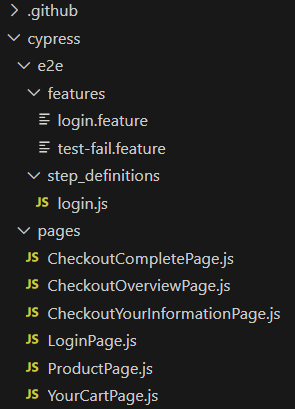

[](https://www.cypress.io/)

# SauceDemo with BDD
This repository contains a technical automation challenge involving JavaScript language, Cypress framework, FakerJS framework and Cucumber (BDD).
Site: https://www.saucedemo.com/

### Suggested IDEs by [Cypress documentation](https://docs.cypress.io/guides/tooling/IDE-integration.html#Extensions-amp-Plugins):
- VsCode (Best option to work with Cypress and it's free). 
- Intellij (Alternative solution, also free)

### Git [Download here](https://git-scm.com/downloads):
-It is a distributed version control system mainly used in software development, but can be used to record the edit history of any type of file.

## Dependencies
### Official cypress framework:
- Cypress is a real game changer in e2e testing. It runs inside 2 containers on our stack. The setup was almost easy and its adoption by the team was immediate. Make sure you have Node.js installed and that you have already run "npm init" or have a "node_modules" folder or "package.json" file in the root of your project to ensure cypress is installed in the correct directory.
- [Cypress website](https://www.cypress.io/).
- The API documentation is available [here](https://docs.cypress.io/api/api/table-of-contents.html).
> ```bash
>  npm install cypress --save-dev
> ```

### FakerJS framework:
- Appearance. Faker. Generate massive amounts of fake (but realistic) data for testing and development purposes.
- [Faker website](https://fakerjs.dev/guide/).
> ```bash
>  npm install @faker-js/faker --save-dev
> ```

### cypress-cucumber-preprocessor:
- Cypress Cucumber Preprocessor is a plugin for the Cypress testing framework that allows you to write end-to-end tests using the Cucumber testing framework's Gherkin syntax.
- [cypress-cucumber-preprocessor](https://github.com/badeball/cypress-cucumber-preprocessor).
> ```bash
>  npm install @badeball/cypress-cucumber-preprocessor
> ```

### cypress-esbuild-preprocessor:
- Preprocessors. A preprocessor is the plugin responsible for preparing a support file or a test file for the browser. By default, Cypress comes packaged with webpack preprocessor already installed. Read the Preprocessors API docs to learn more.Esbuild is a fast bundler that can optimize JavaScript, TypeScript, JSX, and CSS code.
- [@bahmutov/cypress-esbuild-preprocessor](https://github.com/bahmutov/cypress-esbuild-preprocessor).
> ```bash
>  npm i -D cypress @bahmutov/cypress-esbuild-preprocessor esbuild
> `

---

### Git Clone the repository
After that, you can clone this repository in your local machine.
> ```bash
>  git clone  git@github.com:rcardosopereira/saucedemobdd.git
> ```

Check your current version. The version of this project is:
-NPM Version 10.2.3
-NODE Version v21.2.0

---

## Running the tests
### Cypress run
Cypress give us the ability to run all tests without a test runner interface.
To do this, just run the following command:
> ```bash
> npm run test
> ```

### Cypress test runner interface:
To open the Cypress and run the tests separately, run:
> ```bash
> npm run cy:open 
> ```

or

> ```bash
> npx cypress open
> ```

This will start the Cypress Test Runner with its interactive GUI where you can select which spec
click on E2E Testing

If you want to run the tests in another one, just add browser and the name of the browser in the command. More info in [here](https://docs.cypress.io/guides/guides/launching-browsers#Browsers).

### Project Structure
1. features: Here we have all scenarios of testing using BDD.
2. step_definitions (login.js): This file contains all methods for interact with the application.
3. pages:  This folder containts all elements of our web page.
4. cypress\videos: Here we have some videos as a evidences of automated tests.


### All workflows (GitHub Actions: continuos integration)
We use GitHub actions to build, test and deploy our app. You can check it in [here](https://github.com/rcardosopereira/saucedemobdd/actions).         


### Support
Please, if you have some questions, feel free to write me. My e-mail is rcardosopereira@gmail.com
Thank you very much ;-)
